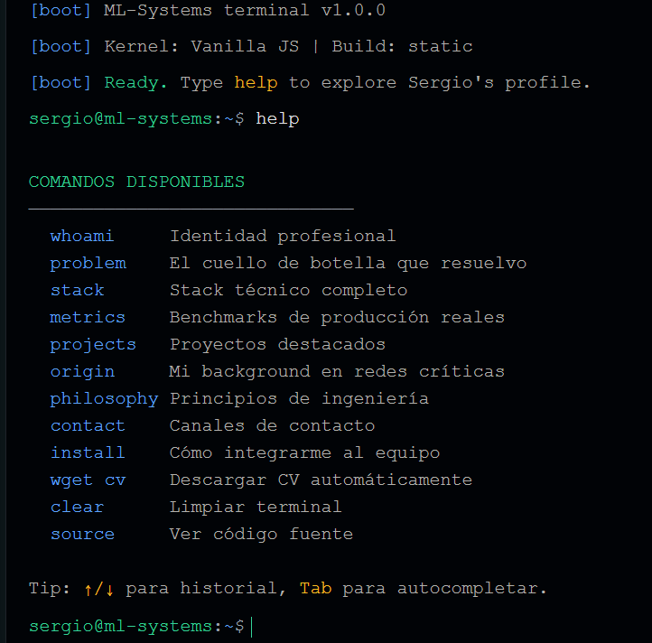

# Sergio Rivera — ML Systems Engineer

> Los modelos mueren en Jupyter. Yo construyo la infraestructura para que sobrevivan en el metal.

Este no es un portafolio tradicional — es una **terminal interactiva** que refleja mi forma de trabajar: métricas reales, código bare-metal, y cero buzzwords vacías.

Escribe `help` dentro de la terminal para explorar mi stack, benchmarks de producción, y background en redes críticas.

# <h1 align="center">Preview de Terminal Interactiva</h1>

  

### 🚀 System Access
Para acceder al perfil interactivo, ejecuta el siguiente comando:

> **[> ./run-portfolio.sh](https://sergius-ds.github.io/Sergio_Rivera/)**
